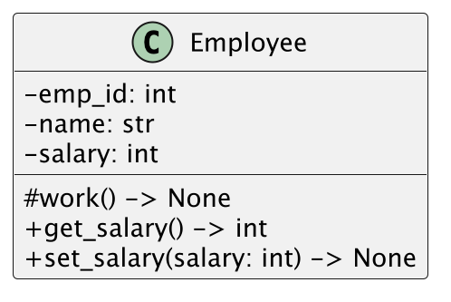
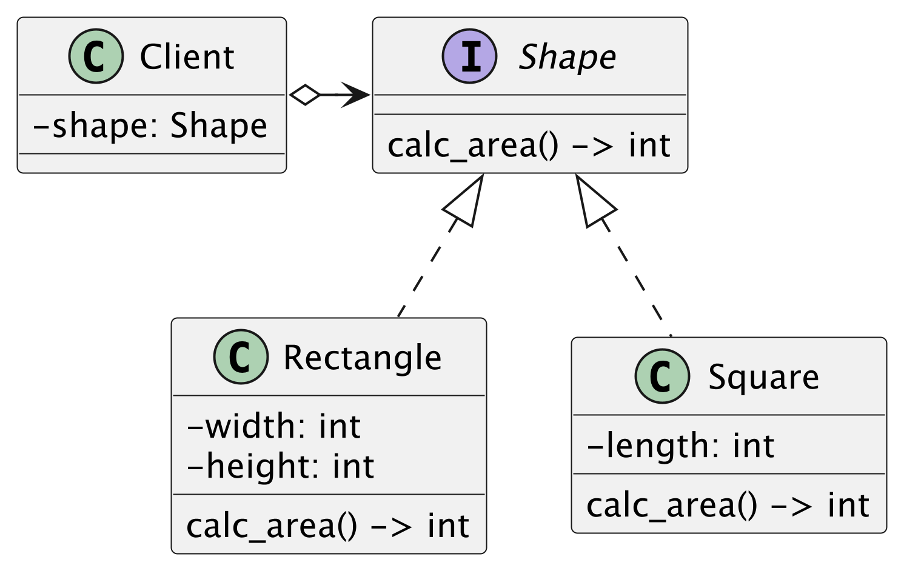

## 演習1
次のクラス図をPythonで実装してください

メソッドの仕様
- workメソッドは"働きます"とログ出力します
- get_salaryメソッドは属性のsalaryを返却します
- set_salaryメソッドは引数のsalaryを属性のsalaryに代入します

## 演習2
次のクラスをPythonで実装してください

メソッドの仕様
- Rectangleの面積はwideとheightの掛け算で算出します
- Squareの面積はlength * lengthで算出します

